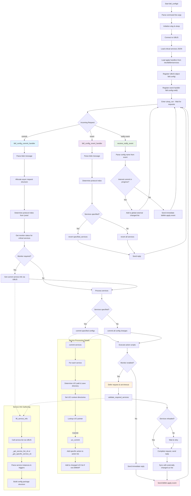

# Utilities to support datamodel deployments

This directory has sets of small utilities to ease the datamodel deployments and integration with higher layer application protocols.

List of utilities:

1. bbf.diag
2. bbf.secure
3. bbf_configd

## bbf.diag utility

`bbf.diag` is a `rpcd` libexec based utility, which is responsible for providing ubus backend to few datamodel diagnostics commands like:

- ipping
- nslookup
- serverselection
- udpecho

### How to add a new bbf.diag utility

To add a new bbf.diag utility user has to add an script with below syntax

```bash
#!/bin/sh

. /usr/share/libubox/jshn.sh
. /usr/share/bbfdm/scripts/bbf_api

__list() {
        json_add_object "test"
        json_add_string "host" "str"
        json_close_object
}

__error() {
        json_init
        json_add_string "Status" "$1"
}

__launch() {
        json_init
        json_add_string "Status" "$1"
}

if [ "$1" = "list" ]; then
        __list
elif [ -n "$1" ]; then
        __launch "$1"
else
        __error "Error_Internal" "1"
fi
```

User needs to install this newly added script using `BBFDM_INSTALL_SCRIPT` bbfdm.mk API.

References:
- [Diagnostics Scripts](https://dev.iopsys.eu/bbf/tr143d/-/tree/devel/scripts/bbf_diag)
- [Installation](https://dev.iopsys.eu/feed/iopsys/-/blob/devel/tr143/Makefile)


## bbf.secure utility

USP[TR369 Specifications](https://usp.technology/specification/index.html#sec:special-roles) requirement of 'SecuredRole' requires bbfdm layer to retrieve and provide the Secured(Password/key) parameter values in plain text.

But storing Secured parameters in plain text in uci/filesystem is bit of a security risk, to mitigate the risk `bbf.secure` provides way to store the Secured parameter values in hashed format.

A how to use guide for bbf.secure available [here](https://dev.iopsys.eu/feed/iopsys/-/tree/devel/bbfdm?ref_type=heads#bbf_obfuscation_key)

## bbf_configd

The BBF Config daemon (`bbf_configd`) is a configuration management system designed for device management. It provides UBUS-based configuration commit and revert operations with service monitoring and reload capabilities.

OpenWRT way of reloading services with `ubus call uci commit '{"name":"<uci_name>"}` does not perfectly fits with datamodel requirements. It send a trigger via rpcd to procd by using this ubus call which returns instantly, internally procd reloads for all the services which has a reload dependency configured on that specific uci.
Sometimes, there is a good amount of delay in trigger and actual service reload.
bbf_configd solves that by adding an in-build reload monitoring functionality which get the list of impacted services and then monitor for PID change for the services with a timeout of 10 sec, with this we make sure Higher layer application(icwmp/obsupa) waits for the application before processing more command.

### Architecture

- **Purpose**: Daemon implementing UBUS interface for configuration management
- **Key Features**:
  - Configuration commit/revert operations
  - Service monitoring and validation
  - Event handling for configuration changes
  - Critical service detection and monitoring

### UBUS Interface

#### Methods

##### `commit`

"commit":{"services":"Array","proto":"String","reload":"Boolean"}
- **Description**: Commits configuration changes and reloads affected services
- **Parameters**:
  - `services` (array): List of specific services to commit
  - `proto` (string): Protocol type ("both", "cwmp", "usp")
  - `reload` (bool): Whether to reload services after commit
- **Response**: Status message indicating success or failure

##### `revert`

"revert":{"services":"Array","proto":"String","reload":"Boolean"}
- **Description**: Reverts uncommitted configuration changes
- **Parameters**:
  - `services` (array): List of specific services to revert
  - `proto` (string): Protocol type
- **Response**: Status message indicating success or failure

#### Events

##### `bbfdm.apply`
- **Trigger**: Sent after configuration commits
- **Payload**: Protocol information and list of changed UCI files
- **Purpose**: Notifies components about applied configuration changes to perform synchronization if required

### Configuration Management

#### Protocol Support
The daemon supports multiple protocols with dedicated configuration directories:

| Protocol | Config Directory | DMMAP Directory | Index |
|----------|------------------|-----------------|-------|
| both     | `/tmp/bbfdm/.bbfdm/config/` | `/tmp/bbfdm/.bbfdm/dmmap/` | 0 |
| cwmp     | `/tmp/bbfdm/.cwmp/config/` | `/tmp/bbfdm/.cwmp/dmmap/` | 1 |
| usp      | `/tmp/bbfdm/.usp/config/` | `/tmp/bbfdm/.usp/dmmap/` | 2 |

#### UCI Integration
- **Standard UCI Path**: `/etc/config/`
- **DMMAP UCI Path**: `/etc/bbfdm/dmmap/`
- **Operations**: Commit, revert, and list configurations
- **Persistence**: Changes saved to protocol-specific directories

### Service Management

#### Service Monitoring
- **Validation**: Checks if services are properly reloaded after configuration changes
- **Criteria**:
  - Instance status changes (running/stopped)
  - Process ID (PID) changes
  - Instance count changes
- **Timeout**: Configurable wait time for service reload validation

#### Critical Services
- **Definition File**: `/etc/bbfdm/critical_services.json`
- **Purpose**: Identifies services that require monitoring during configuration changes
- **Effect**: Enables asynchronous request handling with validation

#### External Handlers
- **Configuration Path**: `/etc/bbfdm/services/`
- **Types**: DMMAP and UCI handlers
- **Default Handler**: `/etc/bbfdm/bbf_default_reload.sh`
- **Purpose**: Custom scripts for service-specific configuration handling

##### Example and Explanation

```json
{
  "daemon": {
    "enable": "1",
    "service_name": "xxxx",
    "unified_daemon": true,
    "services": [
      {
        "parent_dm": "Device.",
        "object": "XXXX"
      }
    ],
    "config": {
      "loglevel": "3"
    },
    "apply_handler": {
      "uci": [
        {
          "file": [
            "xxxx",
            "yyyy"
          ],
          "external_handler": "/etc/xxxx/bbf_config_reload.sh"
        }
      ],
      "dmmap": [
        {
          "file": [
            "zzzz"
          ],
          "external_handler": "/etc/xxxx/bbf_dmmap_handler.sh"
        }
      ]
    }
  }
}
```

- If external component asks to commit UCI file 'xxxx' or 'yyyy' or both then this module will commit the changes from protocol based UCI save directory to the standard UCI and will execute the script provided in the `external_handler` field. If no external handler is provided then it will execute default reload handler script `/etc/bbfdm/bbf_default_reload.sh`.
- If there is any change in the dmmap file `zzzz` and a commit request has been received then this module will commit the changes in standard dmmap file from the protocol based dmmap directory and if any external handler is given like in above example then it will execute that script. Services may use this handler script to perform any desired tasks on changes in the dmmap file.

### Operational Flow

#### Commit Operation
1. Parse incoming UBUS request parameters
2. Load critical services configuration
3. If monitoring required, capture current service states
4. Process configuration changes:
   - Specific services: Process only requested services
   - All services: Process all modified configurations
5. Execute external handlers for affected services if any otherwise default handler
6. If monitoring enabled:
   - Defer response and validate service reloads
   - Send response after validation or timeout
7. Send bbfdm.apply event with list of all modified UCI names
8. Clean up allocated resources

#### Revert Operation
1. Parse incoming UBUS request parameters
2. Revert UCI changes for specified or all services
4. Return immediate success response

#### Flow Diagram



### Error Handling

#### Common Error Scenarios
- **Memory Allocation Failures**: Proper cleanup and error responses
- **UCI Operation Failures**: Logging and graceful continuation
- **UBUS Communication Errors**: Timeout handling and retries
- **Service Validation Timeouts**: Fallback completion after maximum wait time

### Configuration Files

#### Critical Services Definition (`critical_services.json`)
```json
{
  "cwmp": ["cwmp_service"],
  "usp": ["usp_service"]
}
```

##### Example
```bash
cat /etc/bbfdm/critical_services.json 
{
        "usp": [
                        "/etc/config/mapcontroller",
                        "/etc/config/wireless",
                        "/etc/bbfdm/dmmap/WiFi",
			...
			...
        ],
        "cwmp": [
                        "/etc/config/mapcontroller",
                        "/etc/config/wireless",
                        "/etc/bbfdm/dmmap/WiFi",
                        ...
                        ...
        ]
}
```

#### Service Configuration for apply handler (`services/*.json`)
```json
{
  "daemon": {
    "enable": "0 or 1",
    "service_name": "name_of_the_service",
    ...
    ...
    "apply_handler": {
      "uci": [
        {
          "file": ["config_name"],
          "external_handler": "/path/to/handler.sh"
        }
      ],
      "dmmap": [
        {
          "file": ["dmmap_file"],
          "external_handler": "/path/to/dmmap_handler.sh"
        }
      ]
    }
  }
}
```

### Usage

#### UBUS Commands
```bash
# Commit all changes
ubus call bbf.config commit '{"proto":"both", "reload":true}'

# Commit specific services
ubus call bbf.config commit '{"services":["network","wireless"], "proto":"both"}'

# Revert all changes
ubus call bbf.config revert '{"proto":"both"}'

# Revert specific services
ubus call bbf.config revert '{"services":["network"], "proto":"both"}'
```

### Dependencies

#### Libraries
- `libubox`: UBUS and event loop functionality
- `libuci`: UCI configuration management
- `json-c`: JSON parsing for configuration files
- `libc`: Standard C library functions

#### System Requirements
- OpenWrt-based system
- UBUS daemon running
- UCI system configured
- Proper directory structure for configuration files
